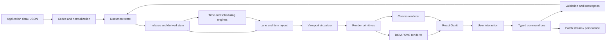

# Architecture: React Gantt and Scheduling Library

Status: Architecture baseline
Last updated: 2026-07-29

## 1. Executive summary

This repository will contain a React and TypeScript library for building:

- traditional project Gantt charts;
- resource and capacity planners;
- scheduling timelines with multiple entries per lane;
- read-only roadmaps and interactive planning applications.

The library must not model a lane as a task. Tasks, lanes, resource assignments, and
visual placements are separate concepts. This is the most important decision in the
architecture: it allows a task tree to be displayed one way in a project view and the
same data to be displayed across resource lanes in a scheduling view.

The implementation is divided into four layers:

1. A framework-independent, serializable data model.
2. Pure engines for commands, time calculations, scheduling, and layout.
3. A renderer-independent viewport made from render primitives.
4. React components, hooks, editors, themes, and accessibility surfaces.

The free and Pro editions use the same public model and extension system. Pro features
are installed as capabilities rather than implemented as conditionals scattered
throughout the free codebase.

## 2. Product goals

### 2.1 Required capabilities

The initial architecture must be capable of supporting:

- arbitrary numbers of lanes and entries;
- zero, one, or many entries in a lane;
- task hierarchies, summary tasks, and milestones;
- dependency links;
- task creation, editing, deletion, movement, and resizing;
- movement between lanes;
- controlled and uncontrolled React usage;
- JSON-compatible persistence and schema migration;
- custom columns, cells, bars, tooltips, editors, and menus;
- horizontal and vertical virtualization;
- React 18 and 19;
- SSR environments such as Next.js;
- responsive and compact layouts;
- equivalent pointer, touch, and keyboard workflows;
- keyboard and assistive-technology access;
- local undo/redo;
- extensible scheduling, calendars, resources, analytics, and export.

### 2.2 Product commitments

The architecture commits to the following product properties:

- Resource lanes and project task trees are both first-class views of the same model.
- Multiple entries per lane are supported from the first release.
- Core state and scheduling logic do not depend on React or the DOM.
- All user changes pass through typed, interceptable commands.
- Changes can be persisted as patches instead of requiring full-data replacement.
- Time zones and daylight-saving changes are explicit model concerns.
- The default renderer is accessible even when a high-performance canvas layer is used.
- Rendering, scheduling, persistence, and licensing are independent boundaries.
- Basic performance, accessibility, and API access are not artificially restricted in
  the free edition.

### 2.3 Non-goals for the initial release

- Building a complete project-management SaaS.
- Owning authentication, billing, or multi-tenant storage.
- Providing real-time collaboration in the first stable release.
- Supporting every scheduling constraint and interchange format immediately.
- Making application-specific business rules part of the core.

## 3. Architectural principles

### 3.1 Serializable state is the source of truth

Persistent state must contain plain data only. It must not contain React elements,
functions, DOM references, class instances, or mutable date objects.

### 3.2 Engines are pure and deterministic

Given the same document, command, configuration, and time-zone data, an engine must
produce the same result. Pure engines are easier to test, run in a worker, use on a
server, and integrate with collaborative systems.

### 3.3 Commands change data; queries derive data

User interactions never mutate records directly. They propose typed commands. Commands
are validated and reduced into a new document plus a patch set. Layout, visibility,
resource load, and critical path are derived queries.

### 3.4 Rendering consumes primitives

Renderers do not interpret business rules. They receive visible primitives such as
lane rectangles, task rectangles, handles, dependency paths, grid lines, and labels.

### 3.5 Capabilities are composable

Advanced features register commands, validators, derived queries, render layers, UI
contributions, or exporters through a stable capability registry.

### 3.6 Public APIs are deliberately small

Only package entry-point exports are public. Internal modules must not be imported by
consumers. Experimental APIs live under an explicit `experimental` export.

## 4. High-level system



## 5. Repository and package structure

Use a monorepo. Internal packages preserve architectural boundaries, but the initial
public installation experience should expose only two primary packages:

- `@scope/gantt` for the free edition;
- `@scope/gantt-pro` for paid capabilities.

The exact scope and product name are intentionally left open.

```text
.
├── apps/
│   ├── docs/                    # Documentation website
│   ├── playground/              # Interactive development playground
│   └── benchmarks/              # Repeatable performance scenarios
├── examples/
│   ├── basic-gantt/
│   ├── resource-planner/
│   ├── controlled-state/
│   ├── nextjs/
│   └── persistence/
├── packages/
│   ├── model/                   # Records, IDs, schemas, codecs, migrations
│   ├── commands/                # Command bus, reducers, patches, history
│   ├── time/                    # Scales, time zones, snapping, calendar primitives
│   ├── layout/                  # Lane, item, label, and dependency layout
│   ├── viewport/                # Virtualization and spatial indexes
│   ├── scheduler/               # Basic dependency graph and validation
│   ├── renderer-svg/            # Default DOM/SVG renderer
│   ├── renderer-canvas/         # Optional high-density renderer
│   ├── react/                   # Components, hooks, editors, accessibility
│   ├── theme-default/           # CSS variables and default visual theme
│   ├── adapters/                # REST and persistence interfaces
│   └── gantt/                   # Public free-edition facade
├── pro/
│   ├── scheduling/              # Calendars, constraints, auto-scheduling
│   ├── resources/               # Assignments, utilization, workload
│   ├── analytics/               # Critical path, slack, baselines, variance
│   ├── import-export/           # PDF, PNG, XLSX, MS Project
│   ├── audit/                   # Persistent history and audit utilities
│   └── gantt-pro/               # Public Pro facade and capability bundle
├── tooling/
│   ├── eslint/
│   ├── test-data/
│   └── release/
└── ARCHITECTURE.md
```

Internal packages may be workspace-only initially. They should be separately
publishable later without requiring a rewrite.

## 6. Domain model

### 6.1 Work, capacity, and presentation are separate

A `Task` describes work. A `Resource` describes a person, asset, room, or capacity
pool. An `Assignment` connects work to a resource and records allocation. A `Lane`
describes where work is displayed. A `Placement` maps a task, assignment, or task
segment into a lane. A `Segment` describes an execution interval within a task.

These entities must not be collapsed into one row record. In particular, an assignment
does not imply a lane and a lane does not imply a resource. A resource-oriented view
may associate a lane with a resource, while status, team, portfolio, and other views
may use lanes that have no resource.

This supports all of the following without changing the source task records:

- one task per row;
- multiple tasks in a resource lane;
- one task assigned to multiple resources;
- one task or assignment displayed in multiple views;
- task grouping by status, team, priority, or arbitrary fields;
- switching between task-tree and resource-planning views;
- split tasks.

Views may derive placements from tasks or assignments. Persisted placements are used
only when the application needs an explicit, stable display mapping. Layout always
consumes normalized `ResolvedPlacement` values, regardless of whether they were
persisted or derived.

### 6.2 Persistent document

```ts
export interface GanttDocument {
  schemaVersion: number;
  revision?: string | number;
  tasks: TaskRecord[];
  resources?: ResourceRecord[];
  lanes?: LaneRecord[];
  assignments?: AssignmentRecord[];
  placements?: PlacementRecord[];
  dependencies?: DependencyRecord[];
  calendars?: CalendarRecord[];
  baselines?: BaselineRecord[];
  metadata?: Record<string, JsonValue>;
}

export interface TaskRecord {
  id: EntityId;
  title: string;
  kind?: "task" | "summary" | "milestone";
  parentId?: EntityId;
  schedule?: TaskSchedule;
  progress?: number;
  segments?: TaskSegment[];
  calendarId?: EntityId;
  constraint?: TaskConstraint;
  fields?: Record<string, JsonValue>;
}

export type TaskSchedule =
  | {
      mode: "instant";
      start?: EpochMilliseconds;
      end?: EpochMilliseconds;
      duration?: DurationValue;
      durationMode?: "elapsed" | "working";
    }
  | {
      mode: "all-day";
      startDate?: LocalDateString;
      endDate?: LocalDateString;
      durationDays?: number;
      durationMode?: "elapsed" | "working";
    };

export interface TaskSegment {
  id: EntityId;
  schedule: TaskSchedule;
}

export interface LaneRecord {
  id: EntityId;
  title: string;
  parentId?: EntityId;
  resourceId?: EntityId;
  order?: number;
  height?: number;
  calendarId?: EntityId;
  fields?: Record<string, JsonValue>;
}

export interface ResourceRecord {
  id: EntityId;
  title: string;
  parentId?: EntityId;
  capacity?: number;
  calendarId?: EntityId;
  fields?: Record<string, JsonValue>;
}

export interface AssignmentRecord {
  id: EntityId;
  taskId: EntityId;
  resourceId: EntityId;
  allocation?: number;
  effort?: DurationValue;
  role?: string;
  fields?: Record<string, JsonValue>;
}

export interface PlacementRecord {
  id: EntityId;
  taskId: EntityId;
  laneId: EntityId;
  assignmentId?: EntityId;
  segmentId?: EntityId;
  order?: number;
  fields?: Record<string, JsonValue>;
}

export interface DependencyRecord {
  id: EntityId;
  fromTaskId: EntityId;
  toTaskId: EntityId;
  type: "finish-to-start" | "start-to-start" | "finish-to-finish" | "start-to-finish";
  lag?: DurationValue;
}
```

### 6.3 Model rules

- IDs are opaque strings at runtime. Numeric input IDs are normalized to strings.
- Intervals are half-open: `[start, end)`.
- Instant schedules persist time as epoch milliseconds.
- All-day schedules persist ISO local dates and are not coerced to midnight instants in
  the document.
- An IANA time-zone ID is supplied separately for display and calendar calculations.
- Persisted state never contains JavaScript `Date` objects.
- A schedule may provide its start and end or its start and duration. Normalization
  resolves this to a canonical interval and reports conflicting inputs.
- Elapsed and working durations are distinct. Calendar rules affect only working
  durations.
- Milestones have zero duration.
- Summary dates are either manual or derived; the selected policy is explicit.
- Assignments always reference a task and a resource; they never reference a lane.
- Allocation and capacity use the same non-negative unit scale; `1` represents one
  full-capacity unit unless an application documents a different scale.
- A lane may reference a resource, but non-resource lanes are equally valid.
- A lane calendar controls presentation, snapping, or collision behavior. Scheduling
  uses task, resource, and project calendars according to explicit precedence.
- A placement always references a task and lane. Its optional assignment must belong to
  that task, and its optional segment must belong to that task.
- Task and segment intervals are scheduling truth. Placements do not carry independent
  dates; layout resolves their intervals from the referenced task or segment.
- Derived placements are session/derived data and are not serialized. Persisted
  placements have stable IDs and participate in commands and patches.
- All extension fields must be JSON-compatible.
- Referential integrity is checked during normalization and command validation.

### 6.4 JSON codec

The codec boundary accepts ergonomic wire formats such as ISO-8601 strings and returns
the canonical runtime document. It is responsible for:

- validation;
- ID normalization;
- date parsing;
- default values;
- schema-version migrations;
- actionable diagnostics;
- serialization back to stable JSON.

Do not mix parsing logic into React components.

## 7. State architecture

State is divided into three categories.

### 7.1 Document state

Serializable business data:

- tasks;
- resources;
- lanes;
- assignments;
- explicit placements;
- dependencies;
- calendars;
- baselines;
- user-defined fields.

### 7.2 Session state

Ephemeral user-interface state:

- selected and focused entities;
- expanded task and lane IDs;
- current viewport and zoom level;
- active editor;
- drag preview;
- column widths;
- temporary filters and sorting.

Applications may choose to persist selected session fields, but they do not belong to
the document by default.

### 7.3 Derived state

Recomputable data:

- entity indexes;
- visible flattened trees;
- scheduled dates;
- resource load;
- critical path and slack;
- resolved placements;
- lane stacks;
- dependency geometry;
- render primitives.

Derived state is cached by document revision and relevant configuration. It must never
be serialized as authoritative data.

## 8. Commands, patches, and events

### 8.1 Command model

Every mutation is represented by a discriminated union:

```ts
export type SchedulePoint = EpochMilliseconds | LocalDateString;

export type GanttCommand =
  | { type: "task.add"; task: TaskInput; parentId?: EntityId }
  | { type: "task.update"; id: EntityId; changes: Partial<TaskRecord> }
  | { type: "task.move"; id: EntityId; start: SchedulePoint }
  | { type: "task.resize"; id: EntityId; edge: "start" | "end"; time: SchedulePoint }
  | { type: "task.split"; id: EntityId; at: SchedulePoint }
  | { type: "task.delete"; id: EntityId; cascade?: boolean }
  | { type: "resource.add"; resource: ResourceInput }
  | { type: "resource.update"; id: EntityId; changes: Partial<ResourceRecord> }
  | { type: "lane.add"; lane: LaneInput }
  | { type: "lane.update"; id: EntityId; changes: Partial<LaneRecord> }
  | { type: "assignment.set"; assignment: AssignmentInput }
  | { type: "assignment.delete"; id: EntityId }
  | { type: "placement.add"; placement: PlacementInput }
  | { type: "placement.move"; id: EntityId; laneId: EntityId }
  | { type: "placement.delete"; id: EntityId }
  | { type: "dependency.add"; dependency: DependencyInput }
  | { type: "dependency.delete"; id: EntityId }
  | { type: "transaction"; commands: GanttCommand[] };
```

### 8.2 Command lifecycle

```text
propose
  -> normalize
  -> before-command interceptors
  -> validate
  -> reduce
  -> schedule/derive affected records
  -> produce patches
  -> commit
  -> after-command events
  -> persistence adapter
```

Interceptors can:

- allow a command;
- reject it with a typed reason;
- modify it;
- replace it with a transaction.

### 8.3 Patch format

Reducers return:

```ts
export interface CommandResult {
  document: GanttDocument;
  patches: GanttPatch[];
  inversePatches: GanttPatch[];
  affectedIds: EntityId[];
  diagnostics: Diagnostic[];
}
```

Patches make undo/redo, optimistic persistence, audit trails, and future collaboration
possible without coupling the library to a specific state manager.

### 8.4 Events

Expose two event levels:

- semantic events such as `taskClick`, `selectionChange`, and `viewportChange`;
- command events such as `beforeCommand`, `commandCommitted`, and `commandRejected`.

Do not create separate mutation pathways for toolbar, context-menu, keyboard, and API
operations. They must dispatch the same commands.

Gestures that change more than one domain concept dispatch transactions. For example,
moving work to a different resource may update an assignment and a placement, while a
pure visual regrouping changes only the placement. The interaction layer must not hide
those differences inside a generic row move.

## 9. Public React API

### 9.1 Controlled usage

```tsx
<Gantt
  document={document}
  onDocumentChange={(nextDocument, change) => {
    setDocument(nextDocument);
    persist(change.patches);
  }}
  view={{ type: "resource", laneIds }}
  timeZone="Europe/Belgrade"
/>
```

### 9.2 Uncontrolled usage

```tsx
<Gantt
  defaultDocument={document}
  onCommandCommitted={({ patches }) => persist(patches)}
/>
```

### 9.3 Imperative handle

The component ref may expose orchestration methods, not a second state model:

```ts
export interface GanttHandle {
  dispatch(command: GanttCommand): Promise<CommandOutcome>;
  getDocument(): GanttDocument;
  getSelection(): SelectionState;
  scrollToTask(id: EntityId, options?: ScrollOptions): void;
  scrollToTime(time: number, options?: ScrollOptions): void;
  fitToProject(): void;
  zoomTo(level: ZoomLevel): void;
  undo(): void;
  redo(): void;
}
```

### 9.4 Customization

Customization is provided through typed slots and contribution registries:

- task and milestone content;
- lane headers;
- grid cells and columns;
- tooltips;
- task editor tabs;
- toolbar and context-menu actions;
- time headers;
- non-working-time backgrounds;
- dependency markers;
- empty-lane content.

Prefer component slots receiving data and behavior props over arbitrary HTML strings.

### 9.5 Subscriptions and React ownership

The public API remains declarative in controlled and uncontrolled modes. Internally,
React surfaces subscribe to the smallest useful state slice:

```ts
export function useGanttSelector<T>(
  selector: (state: GanttRuntimeState) => T,
  isEqual?: (previous: T, next: T) => boolean
): T;
```

Selectors are stable public contracts for document, session, and derived state. A
command affecting one task or lane must not force every visible cell and bar to
re-render. The imperative handle remains limited to commands, viewport orchestration,
focus, and reading snapshots; it is never the primary data-binding API.

## 10. Rendering and layout

### 10.1 Rendering pipeline

```text
normalized document
  -> filtered/sorted view
  -> flattened visible lanes
  -> resolved placements and scheduled intervals
  -> overlap/stack layout
  -> viewport intersection
  -> render primitives
  -> renderer
```

### 10.2 Default renderer

Use a hybrid DOM/SVG renderer initially:

- DOM for the grid, lane headers, editors, menus, and accessible focus targets;
- SVG for task bars, dependencies, grid overlays, and interaction handles;
- CSS transforms for movement during drag;
- React portals for tooltips and dialogs.

SVG is the default because it offers easier customization, hit testing, text handling,
and accessibility than canvas during the early releases.

### 10.3 Canvas renderer

Keep layout and hit testing renderer-independent so a canvas renderer can be added for
high-density scenarios. The canvas renderer should:

- consume the same primitive list;
- use a spatial index for hit testing;
- retain a DOM accessibility overlay for focused and visible items;
- share editors and menus with the default renderer;
- be selected through a renderer capability, not a different component API.

The canvas renderer should be promoted to the default only if benchmarks demonstrate a
material improvement without reducing accessibility or customization.

### 10.4 Lane overlap strategies

Each lane can select an overlap policy:

- `stack`: assign overlapping entries to subrows;
- `overlay`: render entries in the same vertical space;
- `compress`: reduce entry height to fit;
- `reject`: prevent overlapping moves through command validation;
- custom policy supplied by a capability.

Layout returns the effective height of each lane, allowing virtual scrolling with
variable-height rows.

### 10.5 Virtualization

Virtualize both dimensions:

- vertically by flattened lane range;
- horizontally by time-window intersection.

Maintain:

- prefix sums for variable lane heights;
- interval indexes for tasks intersecting the visible time range;
- a spatial index for visible primitives;
- overscan tuned separately for scrolling and dragging.

Only dirty lanes, tasks, dependencies, and time ranges should be recalculated after a
command.

## 11. Time and calendar architecture

Time handling is a dedicated package.

### 11.1 Time scale

The scale converts between time and pixels:

```ts
export interface TimeScale {
  timeToX(time: number): number;
  xToTime(x: number): number;
  getTicks(range: TimeRange, level: ScaleLevel): ScaleTick[];
  snap(time: number, context: SnapContext): number;
}
```

It must support:

- minute through year units;
- custom headers;
- locale-aware labels;
- zoom anchored under the pointer;
- fixed and adaptive scales;
- right-to-left layout;
- optional non-linear working-time compression.

### 11.2 Calendar engine

Calendar math must operate on an IANA time zone and explicit working intervals. It must
not assume that a day is always 24 hours.

The calendar engine supports:

- weekly working rules;
- holidays and exceptions;
- shifts;
- task calendars;
- resource calendars;
- adding and subtracting working duration;
- calculating working duration between instants.

The core defines calendar interfaces and simple continuous-time behavior. Advanced
working calendars are installed by Pro.

## 12. Scheduling architecture

Scheduling is independent of rendering and React.

### 12.1 Basic free scheduler

The free scheduler provides:

- dependency graph construction;
- link-type validation;
- cycle detection;
- dependency visualization;
- diagnostics for invalid links;
- manual task dates.

### 12.2 Pro scheduling pipeline

The Pro engine runs ordered stages:

1. Normalize tasks, constraints, dependencies, and calendars.
2. Validate graph and constraint consistency.
3. Calculate task working durations.
4. Propagate all dependency types, including positive and negative lag.
5. Apply project and task constraints.
6. Recalculate summary intervals and progress.
7. Calculate early and late dates.
8. Calculate critical path and slack.
9. Calculate baselines and schedule variance.
10. Calculate resource utilization.

Stages implement a common interface and publish diagnostics. This allows additional
constraint types without turning the scheduler into one large function.

The scheduler accepts an explicit `direction: "forward" | "backward"` policy. The
direction, project anchor, summary policy, calendar precedence, and conflict policy are
inputs to the calculation and never inferred from UI state.

### 12.3 Explainable schedule results

A successful calculation returns more than final dates:

```ts
export interface ScheduleResult {
  document: GanttDocument;
  changes: ScheduleChange[];
  explanations: ScheduleExplanation[];
  diagnostics: Diagnostic[];
}

export interface ScheduleExplanation {
  code: string;
  entityId: EntityId;
  message: string;
  causeEntityIds?: EntityId[];
  previous?: JsonValue;
  next?: JsonValue;
  details?: Record<string, JsonValue>;
}
```

Explanations cover dependency or constraint propagation, calendar intervals skipped,
capacity violations, rejected requested dates, and changes between schedule revisions.
Their codes and structured details are stable enough for application UI and tests;
human-readable messages may be localized. Fatal graph or constraint problems remain
diagnostics and prevent an authoritative commit.

### 12.4 Worker execution

The engine must be able to run synchronously or through a Web Worker. Worker messages
contain serializable documents, configuration, commands, and patches only.

Use optimistic drag previews in the UI and reconcile them with the authoritative worker
result after the pointer is released.

## 13. Free and Pro capability boundaries

### 13.1 Free edition

The free package should include:

- React and TypeScript APIs;
- arbitrary lanes and multiple entries per lane;
- task tree, summaries, and milestones;
- basic dependencies and cycle diagnostics;
- task and lane CRUD;
- drag, resize, reorder, and cross-lane movement;
- basic snapping and collision policies;
- configurable time scales and zoom;
- filtering and sorting hooks;
- custom columns, renderers, tooltips, menus, and editors;
- JSON codec and migrations;
- REST/persistence interfaces;
- DOM/SVG rendering and virtualization;
- local undo/redo;
- themes, localization, RTL, and accessibility;
- SSR compatibility.

### 13.2 Pro edition

Pro capabilities may include:

- working calendars, shifts, and exceptions;
- automatic dependency scheduling;
- lag, lead, and advanced constraints;
- critical path and slack;
- baselines and variance;
- rollups and derived summary automation;
- resource assignment, capacity, and workload views;
- task and resource calendars;
- split and unscheduled tasks;
- advanced grouping and WBS;
- cross-project planning;
- persistent audit history;
- PDF, PNG, spreadsheet, and project-planning interchange capabilities;
- supported persistence integrations;
- priority support.

### 13.3 Capability registry

```ts
export interface GanttCapability {
  id: string;
  version: string;
  requires?: CapabilityRequirement[];
  setup(context: CapabilityContext): void | CapabilityCleanup;
}

export interface CapabilityContext {
  commands: CommandRegistry;
  validators: ValidatorRegistry;
  queries: QueryRegistry;
  renderLayers: RenderLayerRegistry;
  slots: SlotRegistry;
  exporters: ExporterRegistry;
  diagnostics: DiagnosticRegistry;
}
```

Rules:

- Capability IDs are unique.
- Dependencies and version requirements are checked during initialization.
- Registration order is deterministic.
- Conflicting contributions produce a clear initialization error.
- Free packages never import Pro packages.
- License enforcement occurs at the Pro package boundary, not inside model or renderer
  hot paths.
- Pro packages support offline activation and do not require runtime network calls.
- License scope is independent of deployment domain, server, tenant, or end-user count.
- Activation data must not contain customer project data or deployment identifiers.
- Free and Pro packages with incompatible versions fail early with an actionable error.

## 14. Persistence and backend integration

The component does not own storage. It exposes adapters:

```ts
export interface PersistenceAdapter {
  load(signal?: AbortSignal): Promise<GanttDocument>;
  apply(
    patches: GanttPatch[],
    context: { baseRevision?: string | number; operationId: string }
  ): Promise<{ revision: string | number; idMap?: Record<string, string> }>;
}
```

Required behaviors:

- optimistic updates;
- temporary client IDs and server ID reconciliation;
- conflict reporting;
- retry-safe operation IDs;
- batched transactions;
- cancellation;
- rollback using inverse patches.

The first release should provide examples for REST, GraphQL, Redux, Zustand, and direct
React state. State-manager-specific packages are unnecessary unless examples prove
insufficient.

### 14.1 Partial-data loading

Virtualization limits rendering work; it does not by itself limit data transfer or
memory. Large and hierarchical documents may use a separate query adapter:

```ts
export interface GanttQueryAdapter {
  loadChildren(
    request: { entity: "task" | "lane"; parentId?: EntityId; cursor?: string },
    signal?: AbortSignal
  ): Promise<QueryPage>;
  loadWindow(
    request: { laneIds: EntityId[]; start: number; end: number; cursor?: string },
    signal?: AbortSignal
  ): Promise<QueryPage>;
}
```

The runtime distinguishes `unloaded`, `loading`, `loaded-empty`, and `failed` ranges or
children. Query results pass through the same codec and ID normalization as the initial
document. Overlapping requests are deduplicated, stale responses cannot overwrite
newer revisions, and retries are safe. Commands that depend on unloaded context either
load that context first or require authoritative server validation; they never assume
that missing data means empty data.

## 15. Collaboration readiness

Real-time collaboration is not required initially, but the architecture must not block
it.

Prepare for it by:

- giving every command an operation ID and actor metadata;
- producing small patches and inverse patches;
- separating document and session state;
- keeping reducers deterministic;
- supporting base revisions;
- exposing conflict diagnostics;
- avoiding array indexes as persistent identity.

Do not commit to a CRDT until concurrent editing requirements are validated. A
revisioned command stream with server conflict resolution is sufficient for the first
collaborative implementation.

## 16. Accessibility

Accessibility is an architectural requirement, not a renderer enhancement.

The React layer must provide:

- treegrid semantics for task and lane grids;
- keyboard navigation between rows, cells, and bars;
- keyboard movement and resizing with configurable increments;
- keyboard creation and removal of dependency links;
- announced selection, movement, resize, and validation results;
- visible focus indicators;
- reduced-motion behavior;
- high-contrast theme tokens;
- accessible editor labels and error messages;
- a non-visual summary/table for inspecting task dates, relationships, and validation
  state without using the timeline;

If canvas is used, visible or focused items receive synchronized DOM proxies. The
screen-reader experience must not depend on canvas pixel inspection.

## 17. SSR and browser boundaries

- Packages must not read `window`, `document`, or element dimensions at module scope.
- The initial server render produces deterministic grid and placeholder structure.
- Measurement starts after mounting.
- The library exposes a stable skeleton height to reduce layout shift.
- Browser-only exporters and workers load lazily.
- Hydration must not depend on current time unless the application supplies it.

## 18. Performance targets

Performance claims must be backed by versioned benchmarks.

Initial targets:

- 10,000 tasks and 2,000 lanes in the default benchmark document;
- 100,000 total entries in the high-density canvas benchmark;
- no work proportional to the full dataset during ordinary viewport scrolling;
- 60 frames per second during steady-state pan on reference hardware;
- less than 16 ms main-thread work for optimistic drag frames;
- incremental command processing proportional to affected graph and lanes;
- no unbounded retained render primitives after viewport changes.

Benchmark scenarios must cover:

- flat tasks;
- deep task trees;
- dense lane overlaps;
- long dependency chains;
- resource view;
- frequent live updates;
- zooming across large date ranges.

Performance regression thresholds run in CI on a stable benchmark environment.
Each result records the data-generator version and seed, full and visible entity
counts, build mode, browser, hardware profile, interaction latency percentiles, and
frame-rate distribution. A single maximum-item count is not a sufficient performance
claim.

## 19. Testing strategy

### 19.1 Unit and property tests

- command reducers and inverse patches;
- graph validation and cycle detection;
- interval and overlap layout;
- scale conversion round trips;
- working-time arithmetic;
- DST gaps and repeated hours;
- elapsed-time versus working-time duration semantics;
- all-day versus instant-based task semantics;
- cross-zone display, editing, and resource calendars;
- scheduler invariants;
- schema migrations.

Use property-based testing for interval math, dependency graphs, and patch inversion.

### 19.2 Integration tests

- controlled and uncontrolled React modes;
- pointer, touch, and keyboard interactions;
- async command interception;
- optimistic persistence and rollback;
- worker and synchronous engine parity;
- free and Pro capability compatibility.

### 19.3 Visual and accessibility tests

- visual regression for scales, bars, dependencies, themes, and RTL;
- automated accessibility checks;
- manual screen-reader scenarios for core workflows;
- high-contrast and reduced-motion checks.

### 19.4 Compatibility tests

- React 18 and 19;
- current evergreen browsers;
- Next.js SSR and hydration;
- TypeScript minimum and current versions;
- ESM bundlers and tree shaking.

## 20. Diagnostics and developer experience

All recoverable problems return typed diagnostics:

```ts
export interface Diagnostic {
  code: string;
  severity: "info" | "warning" | "error";
  message: string;
  entityIds?: EntityId[];
  path?: string;
  details?: Record<string, JsonValue>;
}
```

Examples include:

- malformed dates;
- duplicate IDs;
- dangling assignments;
- dependency cycles;
- impossible constraints;
- missing capabilities;
- incompatible free/Pro versions;
- unsupported export fields.

Development builds may show a diagnostic panel. Production behavior is configurable,
but the library must not silently discard invalid data.

## 21. Security and content safety

- Never evaluate user-provided strings as code.
- Avoid raw HTML customization APIs.
- Render custom content through React slots.
- Sanitize any optional rich-text content at an explicit adapter boundary.
- Keep export services opt-in and document what data leaves the browser.
- Support strict Content Security Policy environments.
- Do not put customer data, domains, or project metadata into telemetry by default.

## 22. Versioning and releases

- Use semantic versioning for public packages.
- Version free and Pro facades together.
- Publish a machine-readable capability manifest.
- Define a supported version range between free and Pro packages.
- Maintain JSON schema migrations for persisted documents.
- Keep deprecations for at least one minor-release cycle before removal.
- Generate API reports in CI to detect accidental public-surface changes.
- Offer ESM builds and TypeScript declarations; add other formats only when demand is
  demonstrated.

## 23. Initial implementation slices

### Slice 1: Contracts and model

- Monorepo and package boundaries.
- Record types, codecs, diagnostics, and schema versioning.
- Document, session, and derived-state separation.
- Command bus, patch format, transactions, and history.

Exit condition: tasks, resources, lanes, assignments, placements, and dependencies can
be loaded, validated, mutated, serialized, undone, and redone without React. Their
domain boundaries remain intact throughout the round trip.

### Slice 2: Time, layout, and basic React rendering

- Linear time scale and ticks.
- Lane flattening and variable heights.
- Multiple-entry overlap stacking.
- Two-dimensional viewport.
- DOM/SVG renderer.
- Read-only React component.

Exit condition: a large, read-only task and resource document can be navigated smoothly.

### Slice 3: Interaction and public API

- Selection, drag, resize, creation, deletion, and cross-lane movement.
- Controlled and uncontrolled modes.
- Command interception.
- Component ref.
- Slots, columns, tooltips, menus, and basic editor.
- Keyboard workflows.

Exit condition: applications can implement full CRUD through the same command API used
by built-in UI.

### Slice 4: Project Gantt capabilities

- Task hierarchy.
- Summary and milestone rendering.
- Dependency paths and editing.
- Cycle detection.
- Filtering, sorting, zooming, and localization.
- SSR examples.

Exit condition: the free edition is a complete basic Gantt library.

### Slice 5: Pro scheduling and resources

- Working calendars.
- Auto-scheduling and constraints.
- Critical path, slack, and baselines.
- Resource assignment and workload.
- Split tasks and grouping.
- Worker execution.

Exit condition: Pro covers advanced scheduling and resource-planning use cases.

### Slice 6: Export, hardening, and release

- Export/import capabilities.
- Performance regression suite.
- Accessibility conformance.
- Compatibility matrix.
- Documentation, examples, migration guide, and licensing boundary.

Exit condition: both editions have stable APIs and reproducible release artifacts.

## 24. Architecture acceptance criteria

Before the first stable release:

- A task can appear in a project tree and one or more resource lanes without duplicating
  the task record.
- Resource assignment and visual placement can change independently.
- Multiple overlapping entries can render and be edited in one lane.
- The same command produces identical results in the browser, worker, and Node tests.
- Every built-in mutation is interceptable and emits patches.
- Persisted state round-trips through JSON without losing meaning.
- Scheduling results explain date changes and rejected constraints with stable,
  structured codes.
- Free and Pro capabilities can be installed without changing the React component API.
- A renderer can be replaced without changing scheduling or persistence code.
- Keyboard users can perform the primary task-editing workflows.
- SSR import and hydration succeed without browser globals at module scope.
- Performance benchmarks and thresholds are published and reproducible.

## 25. Open decisions

These decisions should be resolved through small prototypes or architecture decision
records:

1. Final package and product names.
2. Whether the canvas renderer ships in the first stable release.
3. The minimum supported TypeScript and browser versions.
4. Whether runtime schema validation uses a dependency or a small internal codec.
5. The exact patch representation: domain patches, JSON Patch, or both.
6. Whether the public Pro package is one bundle or several separately purchasable
   capabilities.
7. The first supported project-planning interchange format.
8. Whether resource leveling is included in the initial Pro scheduler.
